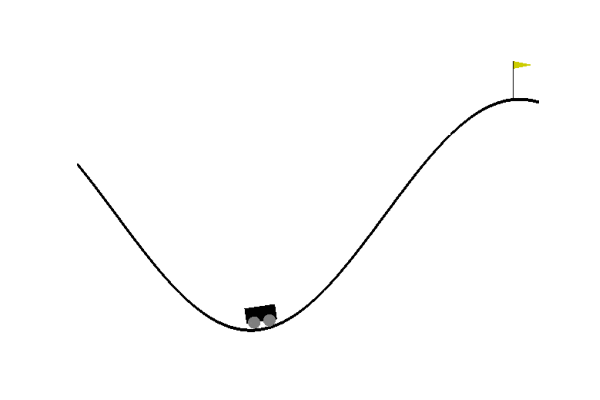
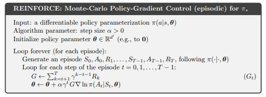
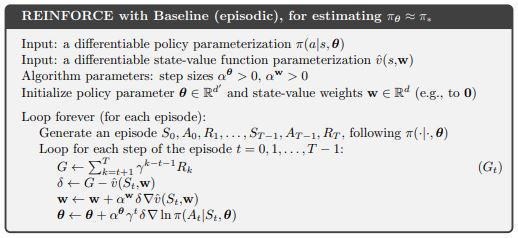
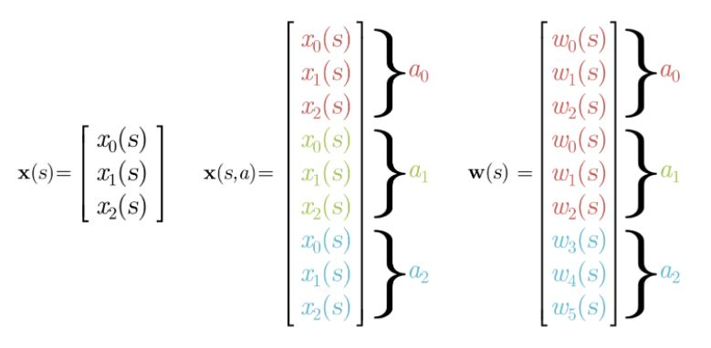
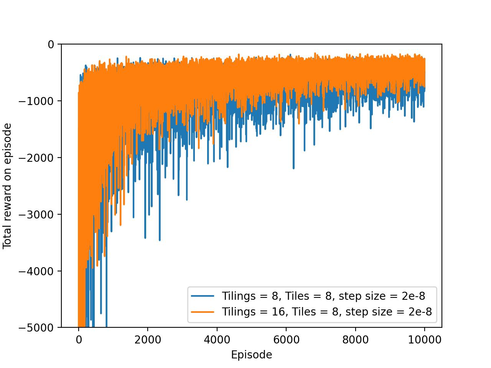
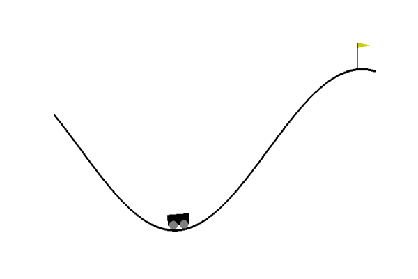
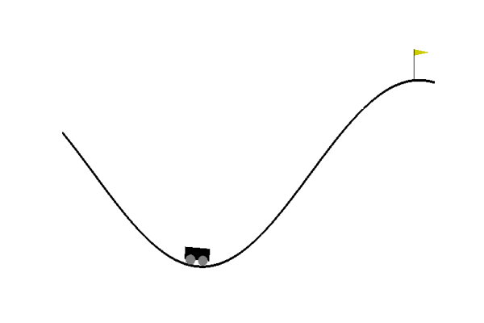

## REINFORCE
This repo constains the implementation of REINFORCE and REINFORCE-Baseline algorithm on Mountain car problem.

The result after training the agent with REINFORCE algorithm or REINFORCE-Baseline will look like this:

## Table of Contensts
* [What is REINFORCE algorithm?](#what-is-reinforce-algorithm)
* [Differentiable policy](#differentiable-policy)
    * [Tile coding](#tile-coding)
    * [Neural network](#neural-network)
 * [Environment (Mountain car)](#environment)
 * [Results](#results)
    * [Total reward](#total-reward)
    * [Agent performance](#agent-performance)
 * [Things I have learnt](#things-i-have-learnt)
 
---
### What is REINFORCE algorithm?

Proposed at 1992, REINFORCE is the root of policy gradient methods.   

In short, the algorithm estimates the return using monte carlo method and in return adjust the policy using gradient ascent.  

Below is the pseudo code:

A modified version on top of REINFORCE is REINFORCE-Baseline.  

REINFORCE-baseline chooses the baseline using value estimate and subtracted from estimated return. The goal is to reduce variance.  

---
### Differentiable policy

REINFORCE algorithm requires a differentiable policy parameterization. In theory, any function approxiamtion algorithm would work.   

For this implementation, I choose tile coding with linear approximation and softmax to keep things simple.  
The policy is given as follows,  

The gradient of the policy is,  

#### Tile coding

The feature x(s,a) is generated through tile coding. This method encodes the entire continous state space into binary vector. To take action into account, the encode vector needs to stack together depending on the number of actions.

#### Neural Network

To do.

---
### Environment

Mountain car is a classical RL example of driving an underpowered car up a steep mountain road.  

 **State** : Car position and velocity  
 **Action** : Left, stationary, right  
 **Reward** : -1 per time step  
 **Terimal state** : Reaching the goal  

---
### Results

#### Total reward

This figure illustrates 2 different tile encoding methods for training over 10,000 episodes.  
As shown, 16 tilings provide better discrimination power and hence more accurate value estimation across states.  

#### Agent performance
After episode 1 (16 tilings, 8 tilings):

After episode 500 (16 tilings, 8 tilings):

After episode 10000 (16 tilings, 8 tilings):

---
### Things I have learnt

1. Reinforcement Learning is prune to silent bug
2. Function presentation plays a big role
3. Choosing appropriate step size for gradient ascent is difficult
4. Monte Carlo methods are high variance especially when terminal state is hard to reach
5. Probably needs experience replay strategy to get faster convergence
6. An alternative way to detect divergence is by monitoring weights change
 
